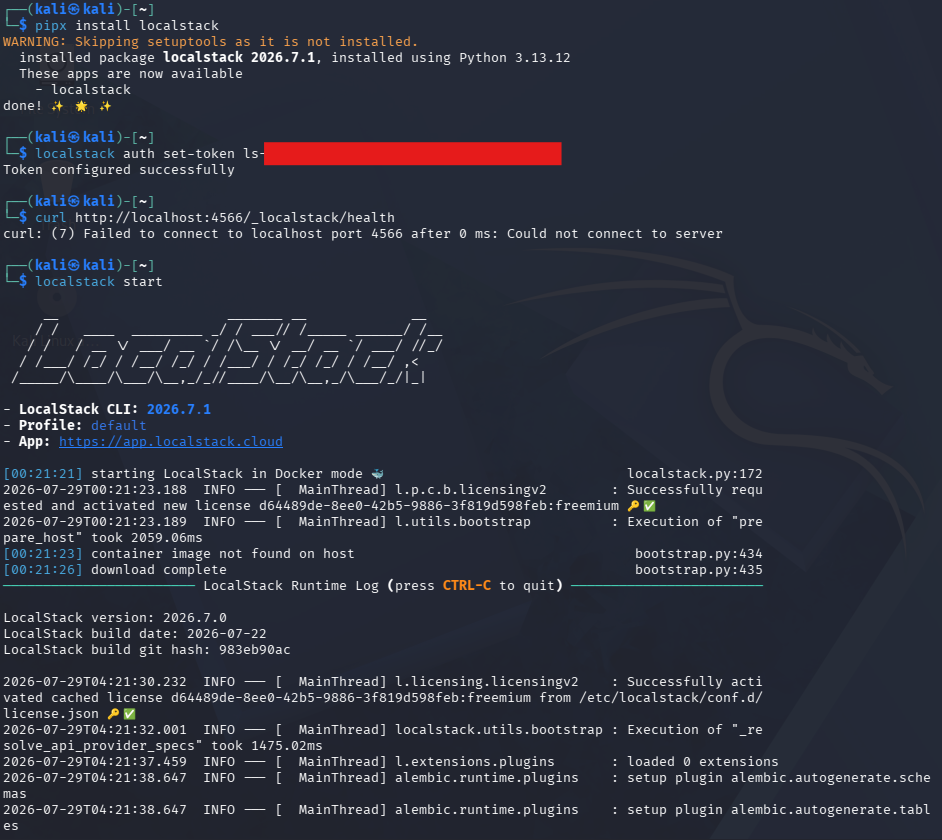
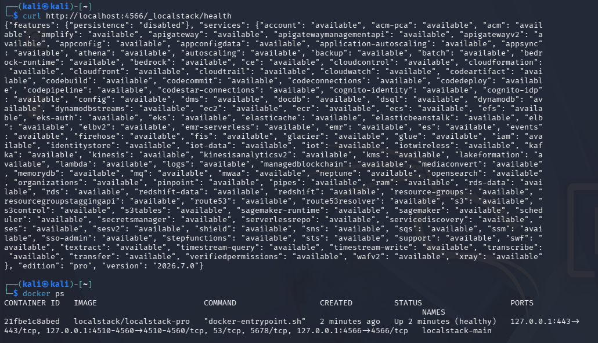

# Lab 0: Environment Setup Report

## Course Information

**Course:** IKB42603 Cloud Computing Security Essentials  
**Lab:** Lab 0 - Environment Setup  
**Name:** YOUR FULL NAME HERE  
**Date:** 29 July 2026  

## Objective

The objective of this setup is to prepare the local lab environment required before Lab 1. Based on the setup cheatsheet, the environment must support Docker, AWS CLI v2, kind, kubectl, OpenSSL, oathtool, LocalStack, and a local Kubernetes cluster.

All services are intended to run locally. LocalStack is used as the local AWS simulator, and kind is used to run Kubernetes inside Docker.

## Environment Summary

Evidence is provided for the Kali environment.

| Component | Kali Verified Version / Status | Kali Proof |
|-----------|--------------------------------|------------|
| Docker | Docker version 28.5.2 | `Evidence/kali/1.docker.png` |
| AWS CLI | aws-cli/2.36.9 | `Evidence/kali/2.awscli.png` |
| kind | kind v0.23.0 | `Evidence/kali/3.kind&kubectl.png` |
| kubectl | Client version v1.33.4, Kustomize v5.5.0 | `Evidence/kali/3.kind&kubectl.png` |
| OpenSSL | OpenSSL 3.5.5 | `Evidence/kali/4.Helper.png` |
| oathtool | OATH Toolkit 2.6.14 | `Evidence/kali/4.Helper.png` |
| LocalStack | Running and healthy on port 4566 (v2026.7.0) | `Evidence/kali/5.1.localstackhealth.png` , `Evidence/kali/5.localstack.png` |
| Kubernetes | kind cluster `ccse` running with node `ccse-control-plane` ready | `Evidence/kali/6.kubernetes.png` |
| AWS CLI LocalStack endpoint | Dummy credentials configured and STS caller identity tested through LocalStack | `Evidence/kali/7.config.png` |

## Step 1: Install and Verify Docker

Docker is required to run containers, LocalStack, and the kind Kubernetes cluster.

On Linux, Docker was installed using the official convenience script:

```bash
curl -fsSL https://get.docker.com | sh
sudo usermod -aG docker $USER
```
After installation (and re-login), Docker was verified with:
```
docker --version
```
The Kali proof shows Docker version 28.5.2


## Step 2: Install and Verify AWS CLI v2
AWS CLI v2 is required to send AWS-style commands to LocalStack during the labs.
Linux installation:
```
curl "https://awscli.amazonaws.com/awscli-exe-linux-x86_64.zip" -o awscliv2.zip
unzip awscliv2.zip && sudo ./aws/install
```
Verified with:
```
aws --version
```
The Kali proof shows AWS CLI version 2.36.9


No real AWS account is required because all commands are pointed to LocalStack

## Step 3: Install and Verify kind and kubectl
```
# kind
curl -Lo ./kind https://kind.sigs.k8s.io/dl/v0.23.0/kind-linux-amd64
chmod +x ./kind && sudo mv ./kind /usr/local/bin/kind

# kubectl
sudo snap install kubectl --classic
```
Verified with:
```
kind --version
kubectl version --client
```
The Kali proof shows:

kind version 0.23.0,
kubectl client version v1.33.4,
Kustomize version v5.5.0


## Step 4: Install and Verify Helper Tools
```
openssl version
oathtool --version
```
The Kali proof shows:

OpenSSL 3.5.5,
oathtool / OATH Toolkit 2.6.14


Trivy is used later via Docker:
```
docker run --rm aquasec/trivy image <name>
```
## Step 5: Start and Verify LocalStack
LocalStack was installed using the LocalStack CLI and authenticated with a free auth token:
```
pipx install localstack
localstack auth set-token <YOUR_AUTH_TOKEN>
localstack start
```
LocalStack started successfully with version 2026.7.0 and was verified with:
```
curl http://localhost:4566/_localstack/health
docker ps
```
The health endpoint returned available services and docker ps showed the LocalStack container running with a healthy status on port 4566





## Step 6: Create and Verify the Kubernetes Cluster
```
kind create cluster --name ccse
```
Verified with:
```
kubectl cluster-info --context kind-ccse
kubectl get nodes
```
The Kali proof confirms:

Kubernetes control plane is running
Node ccse-control-plane is in Ready state
Kubernetes version v1.30.0

The cluster was later removed with:
```
kind delete cluster --name ccse
```
## Step 7: Configure AWS CLI for LocalStack
```
aws configure set aws_access_key_id test
aws configure set aws_secret_access_key test
aws configure set region us-east-1
```
In every terminal session:
```
EP='--endpoint-url=http://localhost:4566'
aws $EP sts get-caller-identity
```
The Kali proof shows the dummy credentials configured and a successful STS caller identity response from LocalStack.
```
Pre-Lab Verification Checklist
```
| Check | Kali OS |
|-------------------------------------------------|-------------|
|docker --version prints a version|Completed|
|aws --version prints AWS CLI v2|Completed|
|kind --version works|Completed|
|kubectl version --client works|Completed|
|openssl version works|Completed|
|oathtool --version works|Completed|
|LocalStack health endpoint responds|Completed|
|Kubernetes cluster ccse is running|Completed|
|kubectl get nodes shows a ready node|Completed|
|AWS CLI dummy credentials are configured|Completed|
|LocalStack endpoint variable is configured|Completed|

| Symptom | Recommended Fix |
|--------------------------------------------------------|-------------------------------------------------|
|Cannot connect to Docker daemon|Start Docker or re-login after adding user to the docker group|
|Port 4566 already in use|docker rm -f localstack then start again|
|AWS CLI cannot connect to endpoint URL|Make sure LocalStack is running and use $EP|
|kind cluster creation fails|Make sure Docker is running and has enough memory|
|MFA / TOTP code fails in later labs|Enable automatic system time synchronization|

## Conclusion
The Lab 0 environment setup was completed successfully on Kali Linux. Docker, AWS CLI v2, kind, kubectl, OpenSSL, oathtool, LocalStack, and the local kind Kubernetes cluster were installed and verified. The environment is ready for the next IKB42603 Cloud Computing Security Essentials lab activities using LocalStack and Kubernetes.
