# IKB42603 Cloud Computing Security Essentials
## LAB 1 WEEKS 1-2: Cloud Account Security, Identity & Access Management
**Identity governance and least privilege: LocalStack IAM & Kubernetes RBAC**

---

### Course & Assessment Mapping

| Item | Mapping |
| :--- | :--- |
| **Course Learning Outcome** | CLO2 - Construct secure cloud operations that safeguard data integrity |
| **Lecture topics** | Weeks 1-2 (Fundamentals, Security Architecture) Weeks 5 & 7 (Access Control, Identity) |
| **Value / skill clusters** | VBE3 (Integrity) SC8 (Integrated Problem-Solving) |
| **Assessment** | Lab report (screenshots + CLI output + short answers) contributes to the Lab Assignment |

---

### Lab Arrangement (2 Sessions over 2 Weeks)

| Session | Week | Focus |
| :--- | :--- | :--- |
| **Session A** | Week 1 | Environment setup + cloud identity with LocalStack IAM (Tasks 1–4) |
| **Session B** | Week 2 | Enforced access control with Kubernetes RBAC + audit (Tasks 5–7), then the report |

> **Note:** Complete Session A fully before Session B. Keep your commands and screenshots as you go; you will submit them in the report at the end of Session B.

---

### Technical Prerequisites
- A laptop with at least 8 GB RAM and administrator rights to install software.
- Docker Desktop (Windows/macOS) or Docker Engine (Linux) - free.
- AWS CLI v2 free command-line tool (we point it at LocalStack, not real AWS).
- `kind` (Kubernetes-in-Docker) and `kubectl` free (used in Session B).
- Internet access only for the first download of the container images; the lab then runs offline.

> **Security tip:** Nothing in this lab connects to a real cloud provider — LocalStack emulates AWS APIs locally, and `kind` runs Kubernetes inside Docker on your own laptop.

---

# Session A (Week 1): Cloud Identity with LocalStack

## One-Time Environment Setup

Verify Docker is running, then start LocalStack. Run each command in a terminal:

```bash
# 1. Confirm Docker is installed and running
docker --version

# 2. Start LocalStack (AWS-compatible cloud) in a container
docker run -d --name localstack -p 4566:4566 localstack/localstack

# 3. Confirm it is healthy (should list running services)
curl http://localhost:4566/_localstack/health
```

Point the AWS CLI at LocalStack by creating a helper alias/configuration:

```bash
# Configure dummy credentials (LocalStack accepts any value)
aws configure set aws_access_key_id test
aws configure set aws_secret_access_key test
aws configure set region us-east-1

# Test: this talks to LocalStack, NOT real AWS
aws --endpoint-url=http://localhost:4566 sts get-caller-identity
```

### Deliverable: Operating Identity Output
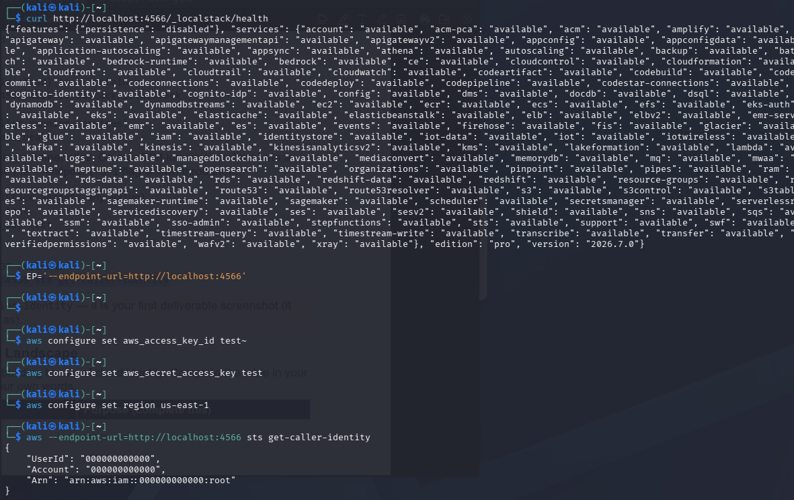

---

## Task 1: Map the Cloud Identity Landscape

Before creating anything, understand the building blocks of cloud identity.

| Concept | AWS term | Purpose |
| :--- | :--- | :--- |
| **All-powerful owner** | Root user | The initial identity created when an AWS account is set up. It has unrestricted access to all resources and services in the account. Should only be used for initial setup and emergency account management. |
| **Human/app identity** | IAM User | An identity created within AWS to represent a specific person or service. Used to interact with AWS resources securely using individual credentials (passwords or access keys). |
| **Permission bundle** | IAM Policy | An object in AWS that defines permissions. Policies specify what actions are allowed or denied on which resources, adhering to the principle of least privilege. |
| **Collection of users** | IAM Group | A collection of IAM users. Groups allow administrators to specify permissions for multiple users at once, making access control management easier and more consistent. |
| **Temporary identity** | IAM Role | An identity with specific permissions that can be assumed by anyone or anything that needs it (e.g., EC2 instance, application, cross-account access) for a temporary duration using temporary security credentials. |

---

## Task 2: Create a Least-Privilege Admin (Stop Using Root)

The root user is a liability. Create a dedicated admin identity and grant permissions through a group, never directly to the user.

```bash
EP='--endpoint-url=http://localhost:4566'

# 2.1 Create a group and attach an admin policy to the GROUP
aws $EP iam create-group --group-name Admins
aws $EP iam attach-group-policy --group-name Admins   --policy-arn arn:aws:iam::aws:policy/AdministratorAccess

# 2.2 Create your personal admin user (replace YOURNAME)
aws $EP iam create-user --user-name CloudAdmin_YOURNAME

# 2.3 Put the user in the group (permissions flow from the group)
aws $EP iam add-user-to-group --group-name Admins   --user-name CloudAdmin_YOURNAME

# 2.4 Verify the membership
aws $EP iam get-group --group-name Admins
```

### Deliverable: Group Membership Verification
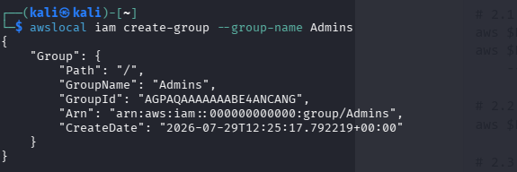

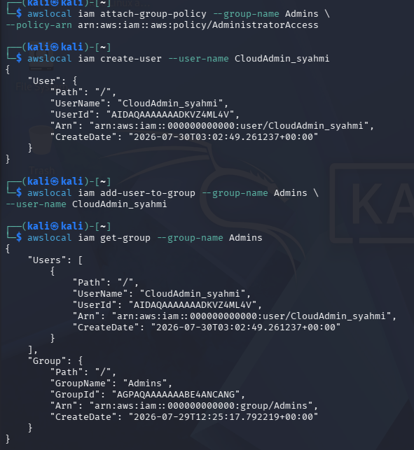

> **Security tip:** Attaching policies to groups (not users) is how you keep permissions manageable and auditable at scale — change the group once, and every member updates.

---

## Task 3: Enforce Least Privilege with a Scoped Policy

Now create a read-only user for a teammate who should never modify data. This demonstrates fine-grained authorization.

```bash
# 3.1 Create a read-only user
aws $EP iam create-user --user-name Analyst_YOURNAME

# 3.2 Attach a scoped, read-only policy (S3 read-only)
aws $EP iam attach-user-policy --user-name Analyst_YOURNAME   --policy-arn arn:aws:iam::aws:policy/AmazonS3ReadOnlyAccess

# 3.3 List what the user can do
aws $EP iam list-attached-user-policies --user-name Analyst_YOURNAME
```

### Deliverable: Analyst Attached Policies
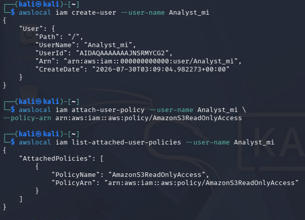

### Blast Radius Reduction Explanation
If the Analyst account credentials were stolen, the potential damage is severely restricted because the identity only possesses `AmazonS3ReadOnlyAccess` permissions. The attacker can only view/read S3 bucket data but cannot delete files, modify resources, shut down servers, create new users, or elevate privileges. This dramatically reduces the **blast radius** compared to a stolen admin account, which could allow total control over the entire cloud infrastructure and data loss.

---

## Task 4: Credential Hygiene & Access Keys

Programmatic access uses access keys. Create one, then reason about the risk of long-lived keys.

```bash
# 4.1 Create an access key for the Analyst
aws $EP iam create-access-key --user-name Analyst_YOURNAME

# 4.2 List access keys (note the AccessKeyId and status)
aws $EP iam list-access-keys --user-name Analyst_YOURNAME

# 4.3 Rotate: deactivate the old key (paste the AccessKeyId)
aws $EP iam update-access-key --user-name Analyst_YOURNAME   --access-key-id <PASTE_KEY_ID> --status Inactive
```

### Deliverable: Access Key Management & Deactivation
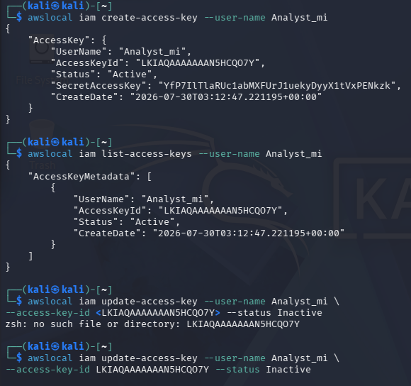

> **Caution:** In real AWS, never create access keys on the root user and never commit keys to code repositories. Prefer short-lived roles over long-lived keys.

---

# Session B (Week 2): Enforced Access Control with Kubernetes RBAC

LocalStack teaches the mechanics of IAM, but it does not fully enforce policies. Kubernetes RBAC does so — in this session you will see access control actually block an unauthorised action.

## Environment Setup: Create a Local Kubernetes Cluster

```bash
# Create a throwaway cluster (runs inside Docker)
kind create cluster --name ccse-lab1

# Confirm it is up
kubectl cluster-info --context kind-ccse-lab1
kubectl get nodes
```
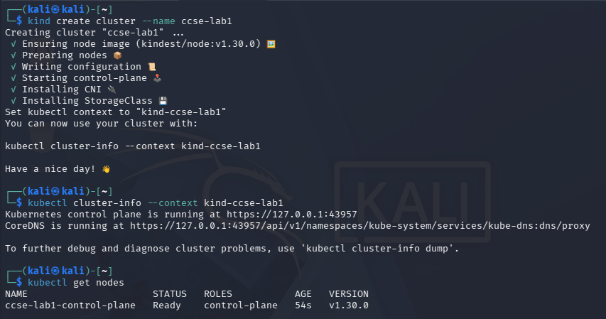

---

## Task 5: Separate Environments with Namespaces

```bash
kubectl create namespace dev
kubectl create namespace prod
kubectl get namespaces
```

### Deliverable: Namespaces Setup
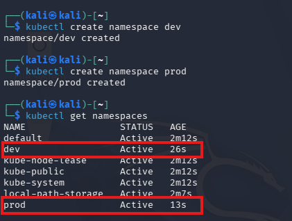

---

## Task 6: Define a Role and Bind It (Least Privilege)

Create a role that can only read pods in `dev`, and bind it to a test service account. This is RBAC: a role (permissions) plus a role-binding (who gets them).

```bash
# 6.1 Create a service account to represent a developer
kubectl create serviceaccount dev-user -n dev

# 6.2 Create a Role that allows only get/list/watch on pods in dev
kubectl create role pod-reader -n dev   --verb=get,list,watch --resource=pods

# 6.3 Bind the Role to the service account
kubectl create rolebinding dev-user-binding -n dev   --role=pod-reader --serviceaccount=dev:dev-user
```

### Deliverable: Role & RoleBinding Setup
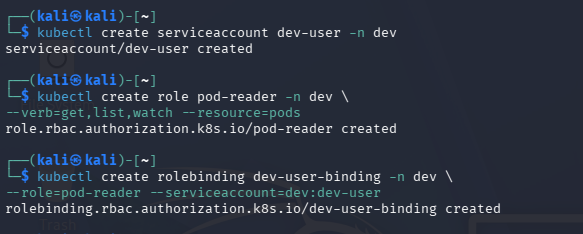

---

## Task 7: Test That Access Control Works

Use `kubectl auth can-i` to prove the boundary. Record every result.

```bash
SA="system:serviceaccount:dev:dev-user"

# Should be YES - reading pods in dev is allowed
kubectl auth can-i list pods -n dev --as=$SA

# Should be NO - deleting pods is not granted
kubectl auth can-i delete pods -n dev --as=$SA

# Should be NO - the role does not extend to prod
kubectl auth can-i list pods -n prod --as=$SA
```

### Deliverable: Access Control Test Results (YES / NO / NO)
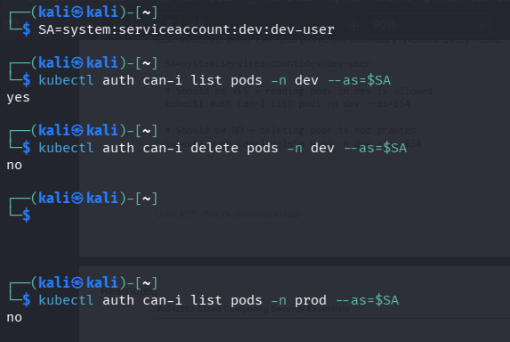

> **Security tip:** This is least privilege enforced by the platform: the developer can do exactly what the role permits and nothing more — even in the same cluster, `prod` is off-limits.

---

# Deliverables & Assessment Answers

## 1. Short-Answer Questions

### Q1. Why is attaching policies to groups better than attaching them directly to users?
Attaching policies to groups centralizes and simplifies permission management across an organization. When user roles or responsibilities change, administrators only need to add or remove users from corresponding groups rather than managing individual policies per user. This prevents permission drift, reduces administrative overhead, ensures consistent security posture, and makes auditing drastically easier.

### Q2. What is the difference between an IAM User and an IAM Role?
An **IAM User** is a permanent identity with long-term credentials (password or access keys) representing a specific person or service. An **IAM Role** is an identity with temporary permissions that can be assumed dynamically by authorized entities (users, services, EC2 instances) for a set duration, using short-lived credentials generated on demand.

### Q3. Explain least privilege using the Analyst account, and how it reduces blast radius if compromised.
The principle of least privilege states that an identity should only be granted the minimum permissions required to perform its function. The Analyst account is restricted to read-only access (`AmazonS3ReadOnlyAccess`). If an attacker steals this account's credentials, the blast radius is minimized because the attacker cannot alter configurations, delete critical databases/files, spin up unauthorized compute resources, or escalate privileges within the account.

### Q4. In Kubernetes, what is the difference between a Role and a RoleBinding?
A **Role** defines a set of permission rules (which verbs like `get`, `list`, `delete` can be performed on which resources like `pods`, `services`) scoped to a specific namespace. A **RoleBinding** links that Role to a subject (such as a ServiceAccount, User, or Group), granting them those defined permissions within that namespace.

### Q5. Why did the developer service account fail to access prod, and which security principle does that demonstrate?
The developer service account failed to access `prod` because the `pod-reader` Role and `dev-user-binding` RoleBinding were explicitly scoped to the `dev` namespace. Kubernetes RBAC defaults to an implicit deny all unless explicitly permitted. This demonstrates the principles of **Least Privilege**, **Default Deny**, and **Blast Radius / Environment Isolation**.

---

## 2. Authentication vs. Authorization Analysis

The three `kubectl auth can-i` commands test authentication followed by authorization:
1. **Authentication Check:** In all three tests, the service account `system:serviceaccount:dev:dev-user` successfully passes authentication because Kubernetes recognizes the valid identity token.
2. **Authorization Results:**
   - `list pods -n dev`: **Passed Authorization (YES)** — Matched rule in `pod-reader` Role allowing `list` on `pods` in namespace `dev`.
   - `delete pods -n dev`: **Blocked by Authorization (NO)** — The `pod-reader` Role only grants `get`, `list`, and `watch`. Since `delete` is omitted, the API server blocks the action.
   - `list pods -n prod`: **Blocked by Authorization (NO)** — The Role and RoleBinding are strictly bound to namespace `dev`. No policy exists permitting access to namespace `prod`.

---

## 3. Verification Command Output

```yaml
# kubectl get rolebinding dev-user-binding -n dev -o yaml

apiVersion: rbac.authorization.k8s.io/v1
kind: RoleBinding
metadata:
  name: dev-user-binding
  namespace: dev
roleRef:
  apiGroup: rbac.authorization.k8s.io
  kind: Role
  name: pod-reader
subjects:
- kind: ServiceAccount
  name: dev-user
  namespace: dev
```

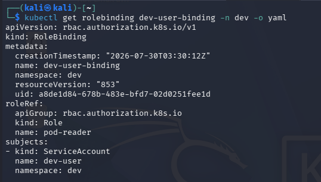

---

## Security Best-Practices Checklist

- [x] Root user is not used for daily tasks (a dedicated admin identity exists).
- [x] Permissions are granted via groups/roles, not directly to individual users.
- [x] At least one least-privilege (read-only) identity was created and tested.
- [x] Access keys were listed and a rotation (deactivate) was demonstrated.
- [x] Kubernetes RBAC blocks an unauthorized action (delete / cross-namespace).

---

## Cleanup & Teardown

```bash
# Remove the Kubernetes cluster
kind delete cluster --name ccse-lab1

# Stop and remove LocalStack
docker stop localstack && docker rm localstack
```

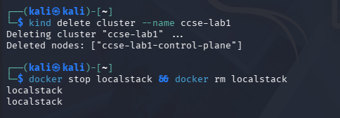

---

## References
1. Course lectures — Week 1 (Fundamentals), Week 2 (Security Architecture), Week 5 (Access Control), Week 7 (Identity Management).
2. LocalStack documentation — `docs.localstack.cloud`
3. Kubernetes RBAC — `kubernetes.io/docs/reference/access-authn-authz/rbac`
4. CSA Security Guidance v5 — Domain on Identity & Access Management.

