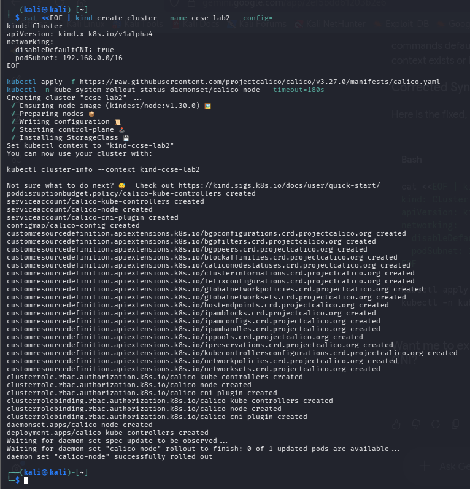
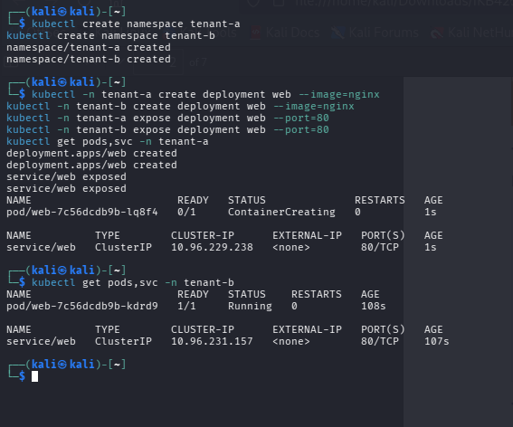
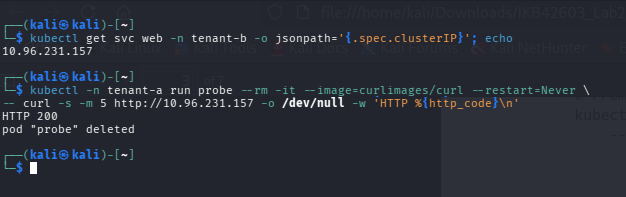
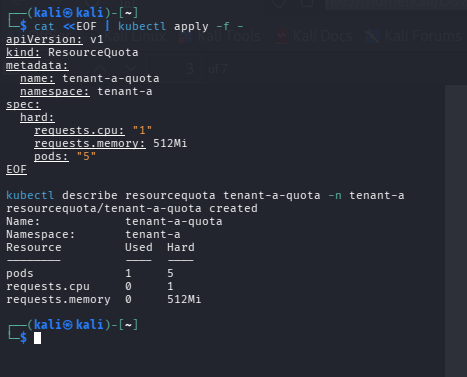
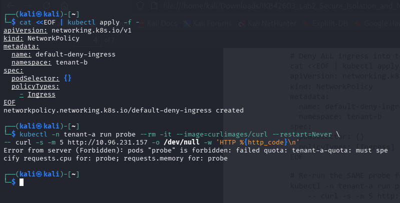
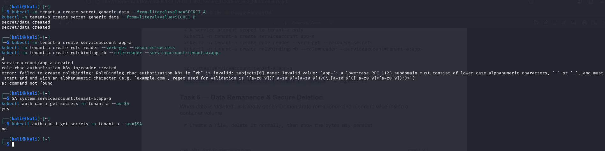
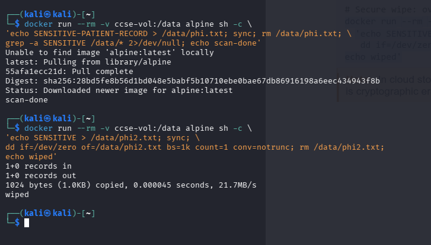
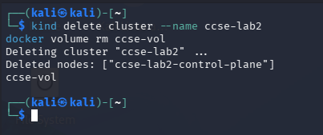

# IKB42603 Cloud Computing Security Essentials
## LAB 2 WEEKS 3-4: Secure Isolation & Multi-Tenancy
**Compute, network and storage isolation - Docker & Kubernetes**

---

### Course & Assessment Mapping

| Item | Mapping |
| :--- | :--- |
| **Course Learning Outcome** | CLO2 - Construct secure cloud operations that safeguard data integrity |
| **Lecture topics** | Week 3 (Secure Isolation of Physical & Logical Infrastructure) |
| **Value / skill clusters** | VBE3 (Integrity) SC8 (Integrated Problem-Solving) |
| **Assessment** | Lab report (screenshots + CLI output + short answers) contributes to the Lab Assignment |

---

### Lab Learning Outcomes
1. Demonstrate compute isolation by separating tenants into containers and Kubernetes namespaces.
2. Observe the default-open behaviour of shared infrastructure and explain why it is a risk.
3. Implement network isolation with a default-deny Network Policy and prove cross-tenant traffic is blocked.
4. Enforce storage isolation so one tenant cannot read another tenant's data or secrets.
5. Explain data remanence and demonstrate secure deletion.

---

### Lab Arrangement (2 Sessions over 2 Weeks)

| Session | Week | Focus |
| :--- | :--- | :--- |
| **Session A** | Week 3 | Compute isolation: containers, namespaces, resource quotas, and the default-open risk (Tasks 1–3) |
| **Session B** | Week 4 | Network & storage isolation: default-deny NetworkPolicy, per-tenant secrets, data remanence (Tasks 4–6), then the report |

> **Note:** Session A shows the problem (shared, open infrastructure). Session B applies the controls that make it safely separated. Keep outputs from both weeks for the report.

---

### Technical Prerequisites
- A laptop with at least 8 GB RAM and admin rights.
- Docker Desktop / Docker Engine - free.
- `kind` and `kubectl` - free.
- Internet only for the first image download; the lab then runs offline.

> **Security tip:** This lab uses a Kubernetes cluster with a CNI that enforces NetworkPolicy. We use `kind` with Calico so that the isolation rules actually take effect (the default `kind` network does not enforce policies).

---

# Session A (Week 3): Compute Isolation & the Default-Open Risk

## Environment Setup: Cluster with Policy Enforcement

```bash
# Create a cluster with the default CNI disabled, then install Calico
cat <<EOF | kind create cluster --name ccse-lab2 --config=-
kind: Cluster
apiVersion: kind.x-k8s.io/v1alpha4
networking:
  disableDefaultCNI: true
  podSubnet: 192.168.0.0/16
EOF

kubectl apply -f https://raw.githubusercontent.com/projectcalico/calico/v3.27.0/manifests/calico.yaml
kubectl -n kube-system rollout status daemonset/calico-node --timeout=180s
```


*GitHub Evidence Link:* [Setup Screenshot](https://raw.githubusercontent.com/ravenous-art/IKB42603-CLOUD-COMPUTING-SECURITY-ESSENTIALS/main/Lab2_Secure%20_Isolation_Multi-Tenancy/Evidence/lab2_setup.png)

> **Note:** If you have no internet in the lab room, your instructor can provide the `calico.yaml` file locally — apply it with `kubectl apply -f calico.yaml`.

---

## Task 1: Two Tenants on One Cluster

Model two customers as two namespaces sharing the same physical infrastructure.

```bash
kubectl create namespace tenant-a
kubectl create namespace tenant-b

# Deploy a simple web server for each tenant
kubectl -n tenant-a create deployment web --image=nginx --port=80
kubectl -n tenant-b create deployment web --image=nginx --port=80

kubectl -n tenant-a expose deployment web --port=80
kubectl -n tenant-b expose deployment web --port=80

kubectl get pods,svc -n tenant-a
kubectl get pods,svc -n tenant-b
```

### Deliverable: Pods and Services in Tenant Namespaces


*GitHub Evidence Link:* [Task 1 Screenshot](https://raw.githubusercontent.com/ravenous-art/IKB42603-CLOUD-COMPUTING-SECURITY-ESSENTIALS/main/Lab2_Secure%20_Isolation_Multi-Tenancy/Evidence/lab2_task1.png)

---

## Task 2: Observe the Default-Open Risk

By default, pods in one namespace can reach pods in another. Prove it: launch a test pod in `tenant-a` and connect to `tenant-b`'s service.

```bash
# Get tenant-b's service IP
kubectl get svc web -n tenant-b -o jsonpath='{.spec.clusterIP}'; echo

# From tenant-a, curl tenant-b (replace <B_IP>)
kubectl -n tenant-a run probe-rm-it --image curlimages/curl --restart=Never   -- curl -s -m 5 http://<B_IP> -o /dev/null -w 'HTTP %{http_code}
'
```

> **Caution:** A result of **HTTP 200** means `tenant-a` reached `tenant-b`. On shared infrastructure, isolation is **NOT** automatic — you must configure it. This is the multi-tenancy risk from Week 3.

### Deliverable: Cross-Tenant Probe Before Network Policy (HTTP 200)


*GitHub Evidence Link:* [Task 2 Screenshot](https://raw.githubusercontent.com/ravenous-art/IKB42603-CLOUD-COMPUTING-SECURITY-ESSENTIALS/main/Lab2_Secure%20_Isolation_Multi-Tenancy/Evidence/lab2_task2.png)

---

## Task 3: Contain the Noisy Neighbour (Resource Quotas)

Isolation is also about resources. Apply a quota so one tenant cannot exhaust the shared node.

```bash
cat <<EOF | kubectl apply -f -
apiVersion: v1
kind: ResourceQuota
metadata:
  name: tenant-a-quota
  namespace: tenant-a
spec:
  hard:
    requests.cpu: "1"
    requests.memory: 512Mi
    pods: "5"
EOF

kubectl describe resourcequota tenant-a-quota -n tenant-a
```

### Deliverable: Resource Quota Applied to Tenant A


*GitHub Evidence Link:* [Task 3 Screenshot](https://raw.githubusercontent.com/ravenous-art/IKB42603-CLOUD-COMPUTING-SECURITY-ESSENTIALS/main/Lab2_Secure%20_Isolation_Multi-Tenancy/Evidence/lab2_task3.png)

> **Note:** End of Session A. Save the HTTP 200 result — you will show that the SAME probe returns a failure after applying network policy in Session B.

---

# Session B (Week 4): Network & Storage Isolation

## Task 4: Default-Deny Network Isolation

Apply a default-deny ingress policy to each tenant, then allow only same-namespace traffic. This is the segmentation principle: deny by default, permit by exception.

```bash
# Deny ALL ingress into tenant-b
cat <<EOF | kubectl apply -f -
apiVersion: networking.k8s.io/v1
kind: NetworkPolicy
metadata:
  name: default-deny-ingress
  namespace: tenant-b
spec:
  podSelector: {}
  policyTypes: [Ingress]
EOF

# Re-run the SAME probe from Task 2 — it should now TIME OUT / fail
kubectl -n tenant-a run probe-rm-it --image curlimages/curl --restart=Never   -- curl -s -m 5 http://<B_IP> -o /dev/null -w 'HTTP %{http_code}
'
```

> **Security tip:** Capture both results side by side: HTTP 200 (before) and timeout (after). This single before/after is the strongest evidence of enforced network isolation.

### Deliverable: Cross-Tenant Probe After Network Policy (Timeout / Blocked)


*GitHub Evidence Link:* [Task 4 Screenshot](https://raw.githubusercontent.com/ravenous-art/IKB42603-CLOUD-COMPUTING-SECURITY-ESSENTIALS/main/Lab2_Secure%20_Isolation_Multi-Tenancy/Evidence/lab2_task4.png)

---

## Task 5: Storage & Secret Isolation

Each tenant stores a secret. Prove that `tenant-a` cannot read `tenant-b`'s secret — storage isolation enforced by RBAC.

```bash
# Create a secret in each tenant
kubectl -n tenant-a create secret generic data --from-literal=value=SECRET_A
kubectl -n tenant-b create secret generic data --from-literal=value=SECRET_B

# A service account scoped to tenant-a only
kubectl -n tenant-a create serviceaccount app-a
kubectl -n tenant-a create role reader --verb=get --resource=secrets
kubectl -n tenant-a create rolebinding rb --role=reader --serviceaccount=tenant-a:app-a

SA="system:serviceaccount:tenant-a:app-a"
kubectl auth can-i get secrets -n tenant-a --as=$SA   # expect: yes
kubectl auth can-i get secrets -n tenant-b --as=$SA   # expect: no
```

### Deliverable: Auth Can-I Secret Isolation Proof (YES / NO)


*GitHub Evidence Link:* [Task 5 Screenshot](https://raw.githubusercontent.com/ravenous-art/IKB42603-CLOUD-COMPUTING-SECURITY-ESSENTIALS/main/Lab2_Secure%20_Isolation_Multi-Tenancy/Evidence/lab2_task5.png)

---

## Task 6: Data Remanence & Secure Deletion

When data is "deleted", is it really gone? Demonstrate remanence and a secure wipe inside a container volume.

```bash
# Create a file, delete it normally, then show the bytes may persist
docker run --rm -v ccse-vol:/data alpine sh -c   'echo SENSITIVE-PATIENT-RECORD > /data/phi.txt; sync; rm /data/phi.txt;   grep -a SENSITIVE /data/* 2>/dev/null; echo scan-done'

# Secure wipe: overwrite before delete (shred)
docker run --rm -v ccse-vol:/data alpine sh -c   'echo SENSITIVE > /data/phi2.txt; sync;   dd if=/dev/zero of=/data/phi2.txt bs=1k count=1 conv=notrunc; rm /data/phi2.txt;   echo wiped'
```

> **Note:** In cloud storage you rarely control physical blocks, so the practical answer to remanence is cryptographic erasure (destroy the key). You will do exactly that in Lab 3.

### Deliverable: Remanence Scan & Secure Wipe Output


*GitHub Evidence Link:* [Task 6 Screenshot](https://raw.githubusercontent.com/ravenous-art/IKB42603-CLOUD-COMPUTING-SECURITY-ESSENTIALS/main/Lab2_Secure%20_Isolation_Multi-Tenancy/Evidence/lab2_task6.png)

---

# Deliverables & Assessment Answers

## 1. Short-Answer Questions

### Q1. Why can containers in different namespaces reach each other by default, and why is that dangerous in multi-tenant cloud?
Kubernetes operates on a default flat network topology where all pods across all namespaces can freely communicate via IP routing without Network Address Translation (NAT), unless explicit network policies are defined. In a multi-tenant cloud environment, this default-open behavior poses severe security risks. If an attacker or malicious tenant compromises a single workload in `tenant-a`, they can perform internal reconnaissance, discover services in `tenant-b`, and launch lateral attacks against sensitive workloads sharing the same underlying cluster.

### Q2. Explain the default-deny principle and how your Network Policy implements it.
The default-deny principle (a foundational Zero Trust concept) dictates that all network traffic, access permissions, or system interactions should be blocked by default, with connectivity explicitly granted on an exception basis. In Task 4, the NetworkPolicy implements default-deny by defining `podSelector: {}` (selecting all pods in namespace `tenant-b`) and listing `policyTypes: [Ingress]` without specifying any `ingress` rules. This immediately drops all incoming network traffic directed at `tenant-b` pods unless an explicit allow rule matches.

### Q3. How do virtual machines and containers differ in isolation strength? When would you add a VM boundary?
- **Isolation Mechanism:** Containers share the underlying host operating system kernel and rely on kernel-level primitives (namespaces and cgroups) for logical segregation. Virtual Machines (VMs) run on a hypervisor layer (Type-1 or Type-2), providing hardware-level virtualization where each VM runs a fully isolated guest operating system kernel.
- **Isolation Strength:** Containers have a higher risk of kernel escape vulnerabilities (e.g., Dirty COW, container breakout bugs), which could compromise the entire host and all co-located containers.
- **When to add a VM boundary:** A VM boundary should be added when running untrusted user code, hosting highly untrusted multi-tenant workloads, handling strict regulatory requirements (e.g., PCI-DSS, HIPAA), or requiring strong hardware boundary separation (e.g., using microVMs like Firecracker or Kata Containers).

### Q4. What is data remanence, and why is cryptographic erasure the preferred cloud solution?
- **Data Remanence:** Data remanence is the residual representation of sensitive data that remains on physical or virtual storage media even after standard file deletion, unlinking, or formatting commands are issued.
- **Cryptographic Erasure in the Cloud:** In cloud environments, customers lack physical access to storage drives to perform physical destruction or lower-level bitwise degaussing. Furthermore, cloud storage uses virtualized abstractions and wear-leveling algorithms. Cryptographic erasure (encrypting data at rest and subsequently destroying the cryptographic key) renders the residual data permanently unreadable and mathematically irrecoverable across all underlying physical media instantly.

### Q5. Which of the three isolation dimensions (compute, network, storage) did each task exercise?
| Task | Isolation Dimension | Description / Mechanism |
| :--- | :--- | :--- |
| **Task 1** | Compute Isolation | Namespace separation and independent pod deployments across tenants. |
| **Task 2** | Network Isolation (Observed Risk) | Demonstrated default flat-network connectivity across namespaces. |
| **Task 3** | Compute Resource Isolation | ResourceQuota enforcing CPU, memory, and pod limits to block noisy neighbours. |
| **Task 4** | Network Isolation | Default-deny NetworkPolicy dropping cross-tenant ingress traffic using Calico CNI. |
| **Task 5** | Storage & Secret Isolation | Kubernetes RBAC preventing cross-namespace secret retrieval. |
| **Task 6** | Storage & Data Remanence | Container volume file persistence analysis and zero-fill sanitization (`dd`). |

---

## 2. Verification Commands Output

```bash
# 1. Verify all active Network Policies across namespaces
$ kubectl get networkpolicy -A
NAMESPACE   NAME                   POD-SELECTOR   AGE
tenant-b    default-deny-ingress   <none>         5m

# 2. Verify Resource Quota status in tenant-a
$ kubectl describe resourcequota tenant-a-quota -n tenant-a
Name:            tenant-a-quota
Namespace:       tenant-a
Resource         Used  Hard
--------         ----  ----
pods             1     5
requests.cpu     0     1
requests.memory  0     512Mi
```

---

## Security Best-Practices Checklist

- [x] Tenants are separated into distinct namespaces.
- [x] A default-deny Network Policy blocks cross-tenant traffic (verified before/after).
- [x] Resource quotas prevent a noisy-neighbour from exhausting shared capacity.
- [x] Per-tenant secrets are unreadable by other tenants (RBAC enforced).
- [x] Secure deletion / cryptographic erasure is understood for data remanence.

---

## Cleanup & Teardown

```bash
# Delete the local Kubernetes cluster
kind delete cluster --name ccse-lab2

# Remove the Docker volume created during Task 6
docker volume rm ccse-vol
```


*GitHub Evidence Link:* [Cleanup Screenshot](https://raw.githubusercontent.com/ravenous-art/IKB42603-CLOUD-COMPUTING-SECURITY-ESSENTIALS/main/Lab2_Secure%20_Isolation_Multi-Tenancy/Evidence/lab2_cleanup.png)

---

## References
1. Course lectures — Week 3 (Secure Isolation of Physical & Logical Infrastructure).
2. Kubernetes Network Policies — `kubernetes.io/docs/concepts/services-networking/network-policies`
3. Calico Documentation — `docs.tigera.io`
4. Cloud Security Alliance (CSA) Security Guidance v5 — Infrastructure & Networking Domain.
