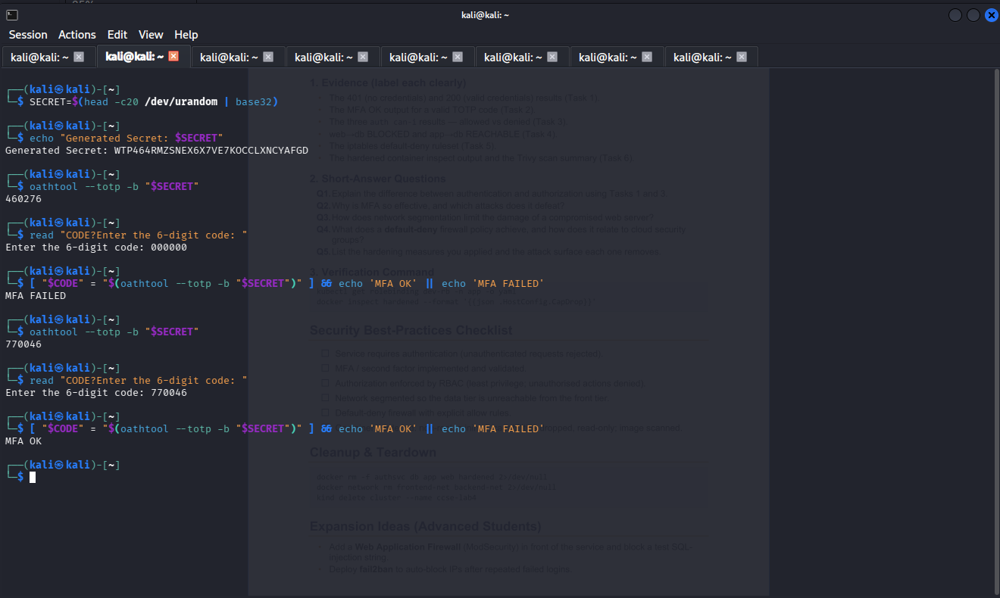
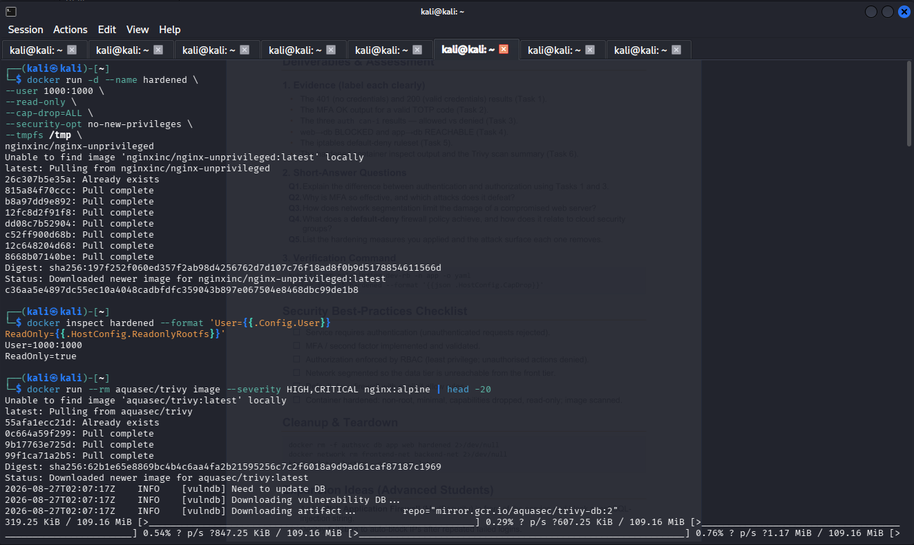
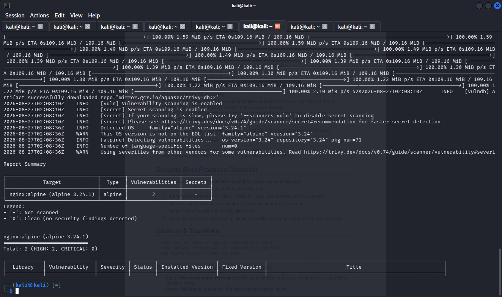
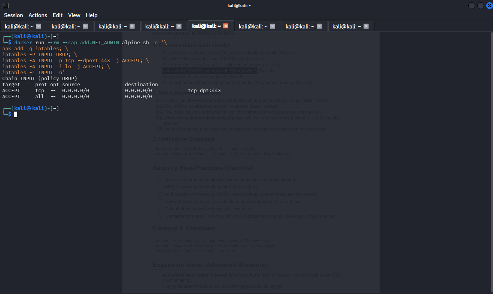

# IKB42603 Cloud Computing Security Essentials Lab Manual
**UniKL MIIT · Prof. Dr. Shahrulniza Musa**

---

## LAB 4 · WEEKS 7–8
### Access Control & Network Security
*AuthN vs AuthZ, network segmentation and host hardening — Docker & Kubernetes*

---

### Lab Learning Outcomes
At the end of this lab, you will be able to:
1. Distinguish and implement authentication (who you are) and authorization (what you may do).
2. Add a second factor with a TOTP (MFA) code and verify it.
3. Configure network access control and segmentation so services reach only what they must.
4. Harden a container image: non-root, minimal, dropped capabilities, read-only filesystem.
5. Scan an image for vulnerabilities and apply the principle of least privilege across compute, network and storage.

---

### Course & Assessment Mapping

| Item | Mapping |
| :--- | :--- |
| **Course Learning Outcome** | **CLO2** — Construct secure cloud operations that safeguard data integrity |
| **Lecture topics** | Week 5 (Access Control) · Week 9 (Network Security patterns) |
| **Value / skill clusters** | VBE3 (Integrity) · SC8 (Integrated Problem-Solving) |
| **Assessment** | Lab report (screenshots + outputs + short answers) — contributes to the Lab Assignment |

---

### Lab Arrangement (2 Sessions over 2 Weeks)

| Session | Week | Focus |
| :--- | :--- | :--- |
| **Session A** | Week 7 | Authentication vs authorization, MFA, and RBAC enforcement (Tasks 1–3) |
| **Session B** | Week 8 | Network segmentation, firewall rules and container hardening (Tasks 4–6), then the report |

> **Note:** Session A controls WHO gets in. Session B controls WHAT they can reach and reduces WHAT an intruder could exploit.

---

### Technical Prerequisites
* A laptop with Docker and a terminal; `kind` and `kubectl` installed.
* `oathtool` for TOTP (install via package manager) — free; or use any authenticator app.
* Trivy container scanner (or `docker scout`) — free.
* Internet only for first image downloads.

> 💡 **Security tip:** Identity is the perimeter. Notice that almost every control in this lab ultimately asks the same two questions: are you who you claim, and are you allowed to do this?

---

## Session A (Week 7) — Access Control & Identity

### Task 1 — Authentication & Authorization (Authentication: a Password-Protected Service)
Run a web service behind HTTP Basic authentication. Only requests with valid credentials get in.

```bash
# Create a password file (user: student)
docker run --rm httpd:alpine htpasswd -nbB student 'P@ssword!' > htpasswd.txt

# Serve a page that requires authentication
cat > default.conf <<'EOF'
server { 
    listen 80;
    location / { 
        auth_basic "Restricted";
        auth_basic_user_file /etc/nginx/.htpasswd;
        return 200 'Authenticated OK\n'; 
    } 
}
EOF

docker run --rm -d --name authsvc -p 8080:80 \
  -v $(pwd)/default.conf:/etc/nginx/conf.d/default.conf \
  -v $(pwd)/htpasswd.txt:/etc/nginx/.htpasswd nginx

curl -s -o /dev/null -w 'no-creds: %{http_code}\n' http://localhost:8080 # 401
curl -s -u student:'P@ssword!' http://localhost:8080                   # 200 Authenticated OK
```

#### Task 1 Evidence
_and_200_(valid_credentials)_results.png)
*(Relative Path: `Evidence/task1.png`)*

---

### Task 2 — Add a Second Factor (MFA / TOTP)
Passwords alone are weak. Generate a time-based one-time password (TOTP) and validate it, using the same mechanism as an authenticator app.

```bash
# Create a shared secret (base32) and generate the current 6-digit code
SECRET=$(head -c20 /dev/urandom | base32)
echo "Enrol this secret in an authenticator app: $SECRET"
oathtool --totp -b "$SECRET"

# Validate a code the user types (compare to the expected value)
read -p 'Enter the 6-digit code: ' CODE
[ "$CODE" = "$(oathtool --totp -b "$SECRET")" ] && echo 'MFA OK' || echo 'MFA FAILED'
```

> **Note:** MFA combines factors from different classes (something you know + something you have). It defeats the majority of credential attacks — the cheapest big security win.

#### Task 2 Evidence

*(Relative Path: `Evidence/task2.png`)*

---

### Task 3 — Authorization: RBAC Roles
Authentication proves identity; authorization decides permissions. Create a cluster and compare a developer role with an admin role.

```bash
kind create cluster --name ccse-lab4
kubectl create namespace app
kubectl create serviceaccount dev -n app

# Developer may only read pods
kubectl create role dev-role -n app --verb=get,list --resource=pods
kubectl create rolebinding dev-rb -n app --role=dev-role --serviceaccount=app:dev

SA="system:serviceaccount:app:dev"
kubectl auth can-i list pods -n app --as=$SA        # yes
kubectl auth can-i create deploy -n app --as=$SA     # no
kubectl auth can-i delete pods -n app --as=$SA       # no
```

> **Note:** End of Session A. Keep the 401/200 results, the MFA OK output, and the three `can-i` results. Stop the auth service (`docker stop authsvc`).

#### Task 3 Evidence


*(Relative Path: `Evidence/task3.png`)*

---

## Session B (Week 8) — Network Security & Hardening

### Task 4 — Network Segmentation (Three-Tier)
Separate a frontend, backend, and database into isolated Docker networks so the frontend cannot reach the database directly — defense in depth for the network.

```bash
# Create two segmented networks
docker network create frontend-net
docker network create backend-net

# DB only on backend-net; app on both; web only on frontend-net
docker run -d --name db --network backend-net redis:alpine
docker run -d --name app --network backend-net nginx
docker network connect frontend-net app
docker run -d --name web --network frontend-net nginx

# web -> db should FAIL (not on the same network)
docker exec web sh -c 'apk add -q curl; curl -m 3 db:6379 || echo BLOCKED'

# app -> db should WORK (shared backend-net)
docker exec app sh -c 'apk add -q curl; nc -z -w3 db 6379 && echo REACHABLE'
```

> 💡 **Security tip:** The database is unreachable from the internet-facing tier. An attacker who compromises the web tier still cannot talk directly to the data — segmentation contains lateral movement.

#### Task 4 Evidence

*(Relative Path: `Evidence/task4.png`)*

---

### Task 5 — Firewall Rules (Default-Deny)
Apply host-level firewall rules that permit only the ports you need. This mirrors cloud security groups.

```bash
# Inside a throwaway container with iptables, model default-deny + allow 443
docker run --rm --cap-add=NET_ADMIN alpine sh -c '\
apk add -q iptables; \
iptables -P INPUT DROP; \
iptables -A INPUT -p tcp --dport 443 -j ACCEPT; \
iptables -A INPUT -i lo -j ACCEPT; \
iptables -L INPUT -n'
```

> **Note:** Default policy `DROP` with a single explicit `ACCEPT` is the security-group model: nothing is allowed unless you permit it (least privilege for the network).

#### Task 5 Evidence

*(Relative Path: `Evidence/task5.png`)*

---

### Task 6 — Container / Host Hardening
Reduce the attack surface. Build a minimal, non-root, capability-dropped, read-only container and scan it.

```bash
# A hardened run of a service
docker run -d --name hardened \
  --user 1000:1000 \
  --read-only \
  --cap-drop ALL \
  --security-opt no-new-privileges \
  --tmpfs /tmp \
  nginxinc/nginx-unprivileged

docker inspect hardened --format 'User={{.Config.User}} ReadOnly={{.HostConfig.ReadonlyRootfs}}'

# Scan an image for known vulnerabilities
docker run --rm aquasec/trivy image --severity HIGH,CRITICAL nginx:alpine | head -20
```

#### Task 6 Evidence

*(Relative Path: `Evidence/task6.png`)*

---

## Deliverables & Assessment

### 1. Evidence (label each clearly)
* The 401 (no credentials) and 200 (valid credentials) results (Task 1).
* The MFA OK output for a valid TOTP code (Task 2).
* The three `kubectl auth can-i` results — allowed vs denied (Task 3).
* `web -> db BLOCKED` and `app -> db REACHABLE` (Task 4).
* The `iptables` default-deny ruleset (Task 5).
* The hardened container `docker inspect` output and the Trivy scan summary (Task 6).

---

### 2. Short-Answer Questions Solutions

#### Q1. Explain the difference between authentication and authorization using Tasks 1 and 3.
* **Authentication (AuthN):** Verified in Task 1, authentication is the process of confirming a user's or entity's identity ("who you are"). By requiring a valid username (`student`) and password (`P@ssword!`), HTTP Basic Auth returns a `200 Authenticated OK` for legitimate credentials while returning a `401 Unauthorized` for missing/invalid requests.
* **Authorization (AuthZ):** Demonstrated in Task 3 via Kubernetes Role-Based Access Control (RBAC), authorization determines what an authenticated identity is permitted to execute ("what you may do"). Even after authenticating as the `app:dev` service account, authorization policies permit listing pods (`kubectl auth can-i list pods` -> `yes`), while blocking administrative actions such as creating deployments or deleting pods (`no`).

#### Q2. Why is MFA so effective, and which attacks does it defeat?
Multi-Factor Authentication (MFA) requires identity verification across two or more distinct evidence classes: **something you know** (passwords) and **something you have** (a TOTP token generator). 

MFA is highly effective because capturing a static password alone is insufficient for account access. It neutralizes:
* **Credential Stuffing & Password Spraying:** Stolen or leaked credentials obtained from third-party breaches cannot authenticate without the dynamic 6-digit TOTP code.
* **Brute-Force Attacks:** Automated dictionary attacks against passwords fail because TOTP keys rotate continuously every 30 seconds.
* **Phishing & Keylogging:** Even if an attacker steals a password via keylogger, they cannot log in without physical access to the TOTP seed/authenticator device.

#### Q3. How does network segmentation limit the damage of a compromised web server?
Network segmentation enforces structural network boundaries that isolate high-risk systems from critical data repositories. In Task 4, the public-facing `web` container resides exclusively on `frontend-net`, while the `db` container operates strictly on `backend-net`. 

If an attacker exploits a web vulnerability (e.g., remote code execution on the `web` tier), network segmentation prevents direct lateral movement to the database (`web -> db` is `BLOCKED`). The attacker cannot query, modify, or exfiltrate database records directly over network sockets, blunting lateral escalation and enforcing a defense-in-depth posture.

#### Q4. What does a default-deny firewall policy achieve, and how does it relate to cloud security groups?
A **default-deny** firewall policy sets the base default action for all inbound/outbound network traffic to `DROP` or `REJECT`, requiring administrators to configure explicit allow rules for required protocols and ports (e.g., port 443 TCP). 

This aligns directly with cloud Security Groups (AWS/Azure/GCP), which enforce an implicit denial by default. The primary benefits include:
* **Attack Surface Reduction:** Unused ports, non-essential network services, and unmonitored protocol channels remain completely unreachable to external networks.
* **Least Privilege Networking:** Limits communication strictly to authorized applications and ports, stopping unauthorized probing, unauthorized ingress, and covert C2 (Command & Control) egress channels.

#### Q5. List the hardening measures you applied and the attack surface each one removes.
1. **Running as Non-Root User (`--user 1000:1000` / `nginx-unprivileged`):** Prevents container breakouts from gaining root privileges on the host system, neutralizing privilege escalation vector attempts.
2. **Read-Only Root Filesystem (`--read-only`):** Blocks attackers from dropping malicious executables, writing web shells, or modifying critical application dependencies inside the container execution environment.
3. **Dropping All Linux Capabilities (`--cap-drop ALL`):** Strips low-level kernel permissions (e.g., `NET_ADMIN`, `SYS_ADMIN`), preventing raw network socket manipulation, kernel module modifications, and process debugging exploits.
4. **Disallowing Privilege Escalation (`--security-opt no-new-privileges`):** Prevents binaries with the SUID or SGID bits set from gaining elevated privileges during execution.

---

### 3. Verification Command
```bash
kubectl get rolebinding dev-rb -n app -o yaml
docker inspect hardened --format '{{json .HostConfig.CapDrop}}'
```

---

## Security Best-Practices Checklist
- [x] Service requires authentication (unauthenticated requests rejected).
- [x] MFA / second factor implemented and validated.
- [x] Authorization enforced by RBAC (least privilege; unauthorized actions denied).
- [x] Network segmented so the data tier is unreachable from the front tier.
- [x] Default-deny firewall with explicit allow rules.
- [x] Container hardened: non-root, minimal, capabilities dropped, read-only; image scanned.

---

## Cleanup & Teardown
```bash
docker rm -f authsvc db app web hardened 2>/dev/null
docker network rm frontend-net backend-net 2>/dev/null
kind delete cluster --name ccse-lab4
```

---

## Expansion Ideas (Advanced Students)
* Add a Web Application Firewall (ModSecurity) in front of the service and block a test SQL-injection string.
* Deploy `fail2ban` to auto-block IPs after repeated failed logins.
* Introduce a service mesh (Istio) and enforce mTLS between services (zero-trust network).
* Turn the hardening steps into a Dockerfile with a distroless base image and rebuild.

---

## References
* Course lectures — Week 5 (Access Control), Week 9 (Network Security patterns).
* Docker security — docs.docker.com/engine/security
* CIS Docker / Kubernetes Benchmarks — www.cisecurity.org
* CSA Security Guidance v5 — Infrastructure & Networking; IAM.
